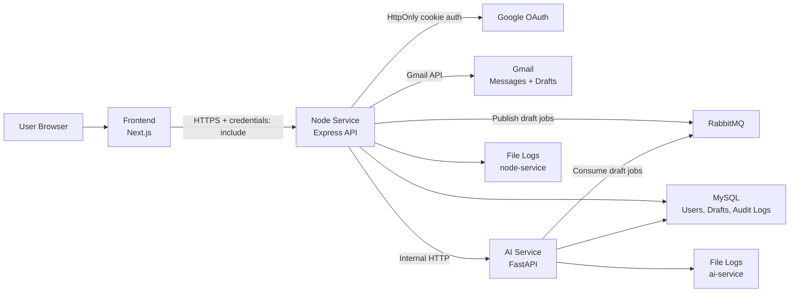

# Draftly System Architecture

Draftly is an email drafting system split into three logical surfaces:

- Frontend: Next.js app for onboarding, dashboard, review, rewrite, approval, and settings.
- Node service: public backend API, auth, Gmail integration, audit logs, app config, billing, and orchestration.
- AI service: private internal service for style analysis, draft generation, and rewrite jobs.

The frontend must only call the Node service. AI service and Gmail calls are backend-owned.

## Architecture Diagram



## Request Flow

### Login

1. Frontend sends the user to `GET /api/auth/google`.
2. Node completes Google OAuth.
3. Node stores the JWT in an HttpOnly cookie named `draftly_token`.
4. Node redirects to `/onboarding` or `/dashboard`.
5. Frontend calls `GET /api/users/me` with `credentials: include`.
6. Frontend stores only safe user metadata in localStorage.

Frontend never reads the HttpOnly token.

### Onboarding

1. Frontend calls `POST /api/users/me/onboarding/analyse`.
2. Node fetches sent Gmail emails.
3. Node calls AI service for style analysis.
4. User reviews and adjusts style profile.
5. Frontend calls `POST /api/users/me/onboarding/complete`.
6. Node stores:
   - `onboardingComplete`
   - `onboardingAt`
   - `profileReviewedAt`
   - `preferences`
   - `user_styles.styleProfile`
   - audit log

### Draft Generation

1. Gmail watch/event reaches Node.
2. Node validates whether an email needs a reply.
3. Node checks whether a draft already exists for `userId + messageId`.
4. Node publishes a RabbitMQ draft job.
5. AI service consumes the job.
6. AI service generates the draft and stores it in MySQL.
7. Draft count increments only when a new draft row is created.

### Rewrite

1. User edits a draft and asks for a rewrite.
2. Frontend calls `PATCH /api/drafts/:id/rewrite`.
3. Node validates ownership and draft status.
4. Node calls AI service internally.
5. AI service updates rewrite fields.
6. Node syncs `finalDraft`, sets status to `pending`, and writes audit log.

### Approval

1. User approves a draft.
2. Frontend calls `PATCH /api/drafts/:id/approve`.
3. Node creates a threaded Gmail Draft.
4. Node sets status to `approved`.
5. Node stores Gmail draft IDs in audit log metadata.
6. Approved drafts become locked in frontend and backend.

## Backend Config

Runtime config is maintained in Node backend:

- `apps/node-service/src/config/appConfig.ts`
- `GET /api/config`

This includes plan limits and onboarding settings. Frontend reads this through Node and should not hardcode plan limits.

## Redis

Redis is not currently used by application code.

Previously it existed in compose/env references only. The backend-only compose no longer starts Redis. Add it back only when a real feature uses it, such as:

- rate limit storage
- background job state
- distributed locks
- cache

## Logging

Logs write to files by default in production.

Node:

```text
/var/log/draftly/node-service/node-service-YYYY-MM-DD.log
```

AI:

```text
/var/log/draftly/ai-service/ai-service-YYYY-MM-DD.log
```

Sensitive keys are masked as `[secure]` before being written.

Examples of masked fields:

- tokens
- cookies
- authorization headers
- passwords
- secrets
- encrypted Gmail tokens
- API keys

Logs are pruned periodically:

- `LOG_RETENTION_DAYS`
- `LOG_PRUNE_INTERVAL_MS`
- `LOG_PRUNE_INTERVAL_SECONDS`

## Environment Files

Use separate templates:

- `.env.development.example`
- `.env.production.example`

Development can log to terminal with `LOG_TO_FILE=false`.

Production should use:

```text
LOG_TO_FILE=true
LOG_RETENTION_DAYS=14
```

## Backend Docker Compose

Backend-only compose:

```powershell
docker compose -f docker-compose.backend.yml up -d --build
```

It includes:

- MySQL
- RabbitMQ
- Node service
- AI service

It does not include frontend.

## Edge Conditions Covered

- Duplicate draft creation skipped by `userId + messageId`.
- Duplicate pending drafts hidden in API list responses.
- Usage count increments only on new draft creation.
- Approved/sent drafts cannot be edited, rewritten, rejected, or sent.
- Approving an already approved draft is idempotent.
- Approved drafts are stored in Gmail Drafts.
- Frontend cannot directly call AI service.
- AI and Node logs mask sensitive fields.
- Onboarding persists reviewed style profile for AI service use.

## Known Follow-Ups

- Add a DB uniqueness constraint for `userId + messageId` after cleaning existing duplicate rows.
- Remove `ioredis` from Node package dependencies if no Redis feature is planned.
- Add production migration flow to backend compose before first deploy.
- Consider file log rotation by size in addition to age if traffic grows.
